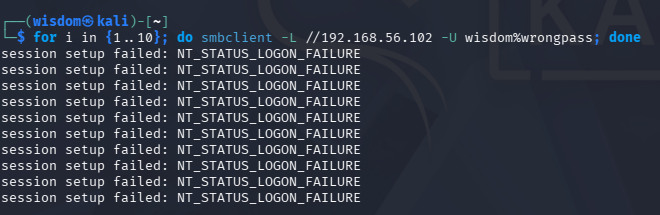
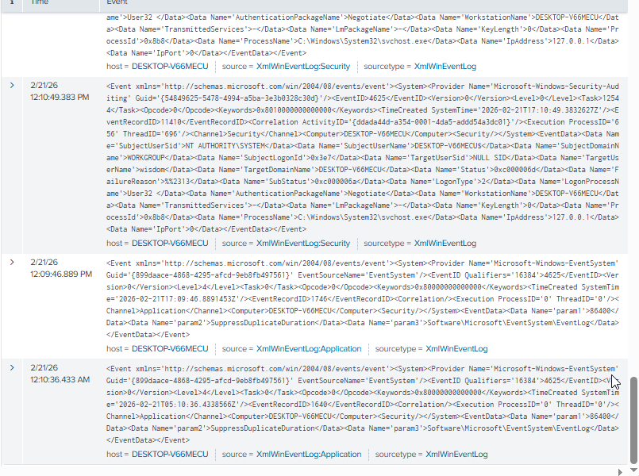
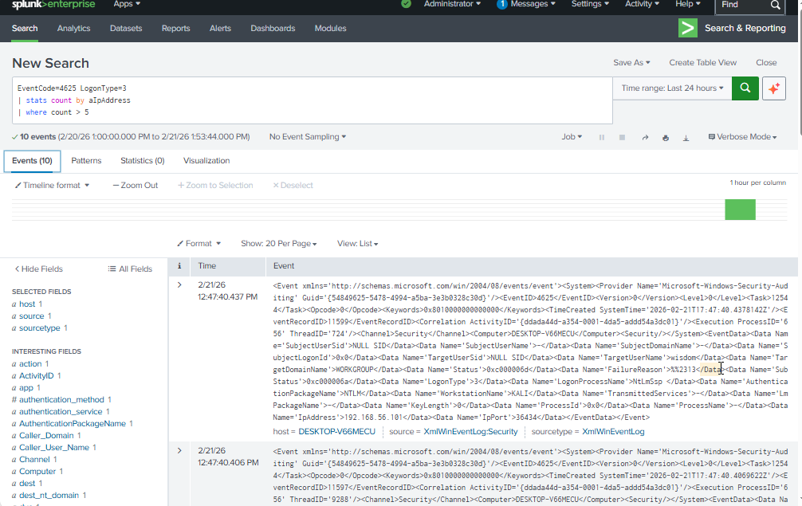
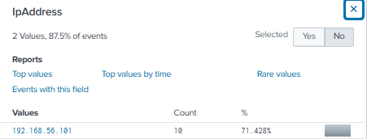
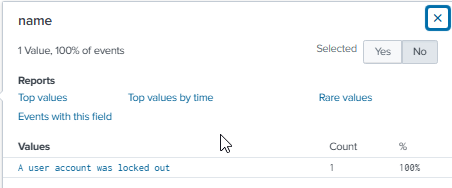
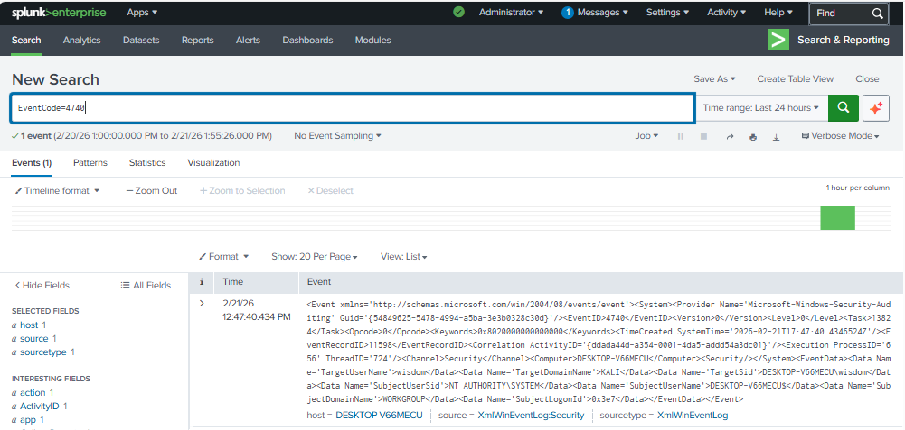
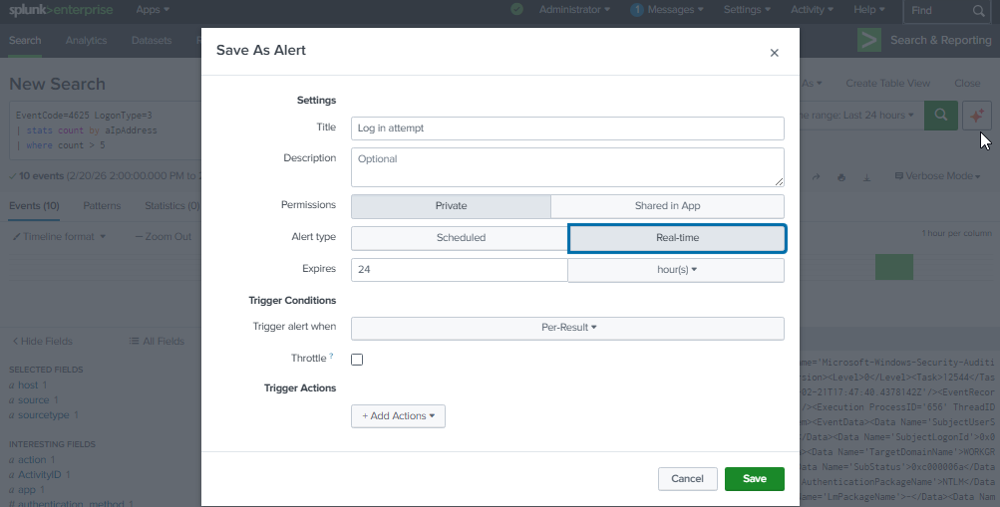
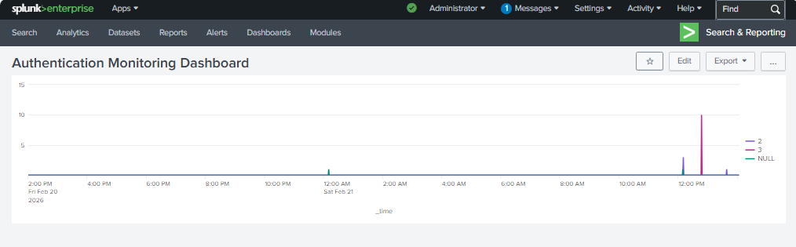

# windows-authentication-monitoring-lab

Main objective of this project is to simulate authentication attacks against a Windows system and detect them using Splunk SIEM.

## Lab Architecture
- Host: Windows 11
- VirtualBox
- Kali Linux (Attacker)
- Windows 10 (Target)
- Splunk Enterprise (SIEM)
- Host-Only Network (192.168.56.0/24)

## Attack Simulation - Local Failed Login
- Entered incorrect password multiple times
- Generated EventCode 4625 (LogonType 2)

## Remote Authentication Attempt (Kali → Windows)

- smbclient -L //192.168.56.102 -U wisdom%wrongpass

- Generated:
- EventCode 4625
- LogonType 3
- Source IP: 192.168.56.101

## Log Detection in Splunk
- Failed Login Detection

- EventCode=4625

## Brute Force Detection Logic
- EventCode=4625 LogonType=3
| stats count by aIpAddress
| where count > 5

## Kali IP address detected:

## Account Lockout Detection
- EventCode=4740

## Alert Configuration
Configured Splunk alert:
Trigger: Results > 0
Time Range: Last 15 minutes
Schedule: Every 15 minutes

## Dashboard Monitoring
- Created authentication monitoring dashboard showing login spikes and source IP activity.

## MITRE ATT&CK Mapping

| Tactic                 | Technique                 | ID     | Description                              |
|------------------------|--------------------------|--------|------------------------------------------|
| Credential Access      | Brute Force              | T1110  | Repeated failed authentication attempts  |
| Discovery              | Network Service Discovery| T1046  | Nmap scanning from Kali                  |
| Discovery              | Network Share Discovery  | T1135  | SMB enumeration attempts                 |

